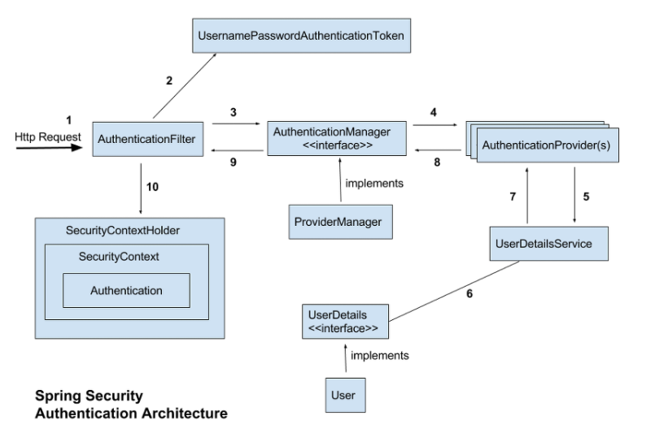

[Back](../FeatIndex.md)

#Spring Security

## TLS/SSL
* 인증서 생성
    * jdk bin 폴더의 keytool 사용
    * .\keytool -genkey -alias cert -storetype PKCS12 -keyalg RSA -keysize 2048 -keystore cert.p12 -validity 36500
        * genkey : 키를 생성하겠음
        * alias : 키의 별칭
        * storetype : 저장 타입
    * sample information
        * Generating 2,048 bit RSA key pair and self-signed certificate (SHA256withRSA) with a validity of 36,500 days
            * for: CN=park, OU=Unknown, O=Unknown, L=Unknown, ST=Unknown, C=Unknown, Password=password

## Spring Boot Security
* Spring 기반의 애플리케이션의 보안을 담당하는 Spring 하위 프레임워크
* "인증" 과 "권한" 에 대한 부분을 Filter 의 흐름에 따라 처리
    * 인증(Authentication)
        * 해당 사용자가 본인이 맞는지를 확인하는 절차
    * 인가(Authorization)
        * 인증된 사용자가 요청한 자원에 접근 가능한지를 결정하는 절차
    * 접근 주체(Principal)
        * 보호 받는 리소스에 접근하는 대상
    * 비밀번호(Credential)
        * 리소스에 접근하는 대상의 비밀번호
* Architecture
    
    ```
    1. 사용자 정보를 담은 http 요청 발생
        * FilterChainProxy 가 이벤트를 받아서 AuthenticationFilter 의 doFilter 메소드 호출
            * FilterChainProxy : Application Filter 와 Servlet 사이의 Spring Security Filter List
    2. doFilter 내부에서 사용자 정보를 토대로 Principal 객체 생성
        * ex) UsernamePasswordAuthenticationToken, PreAuthenticationToken
    3,9. AuthenticationManager Interface 의 객체 생성 후 authenticate 메소드 호출
        * doFilter 내부에서 AuthenticationManager 객체를 가져온다 
    4,8. AuthenticationManager 내부의 AuthenticationProvider 객체의 authenticate 메소드 호출
        * 일부 AuthenticationManager 는 ProviderManager 를 상속
            * 내부에 복수의 AuthenticationProvider 객체를 보유
        * 각 AuthenticationProvider 의 authenticate 호출
        * 하나라도 Provider 의 authenticate 를 통과하면 ok
    5,6,7. 실제 인증 로직 실행
        * db 에서 유저정보 가져와서 인증 비교 로직 실행
    10. static 한 SecurityContext 저장소에다 Principal 객체 저장
        * controller 에서 @AuthenticationPrincipal 를 사용하면, UserDetailService 에서 사용한 모델로 파라미터를 받을 수 있다
            * ex) User
    ```
